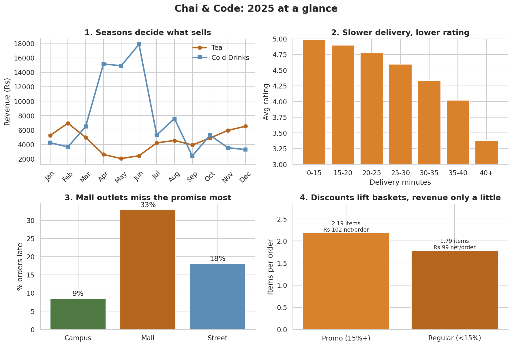
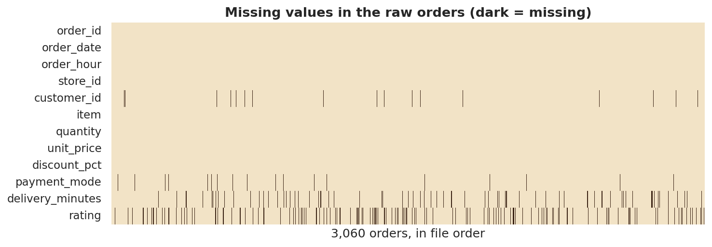
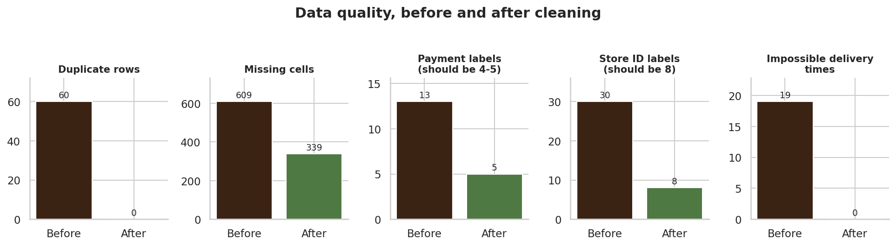
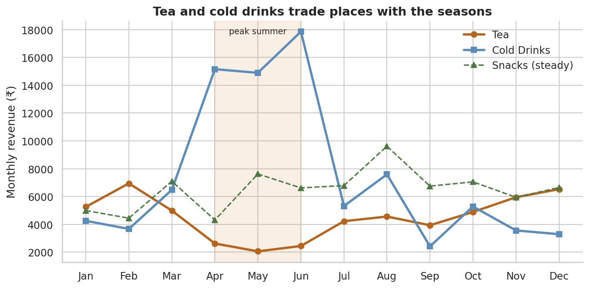
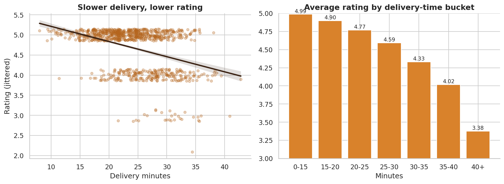
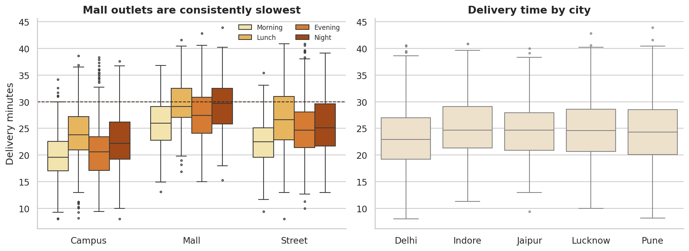
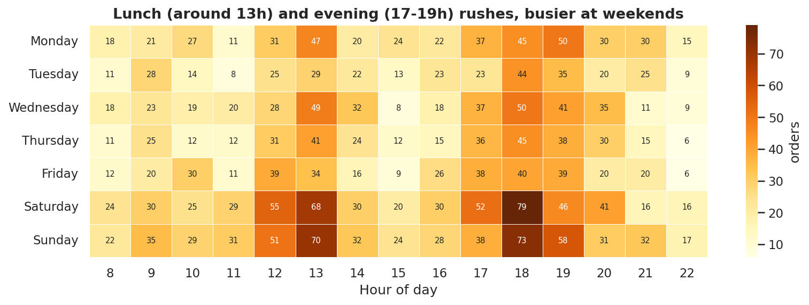

# Chai & Code: A Year of Cafe Orders, Cleaned, Explored and Explained

**Author:** Manindra Shukla

**Program:** Yuva Intern by Henry Harvin, Data Science Track (Project 2)

**GitHub:** [github.com/Manindra07](https://github.com/Manindra07)

**Email:** manindrashukla77@gmail.com



## About the project
This is an end-to-end data analysis project. Instead of a textbook dataset, I built a fictional chain of 8 cafe outlets across 5 cities and generated a **deliberately messy** year of orders (2025). I then audited it, cleaned it, explored it, tested my observations statistically and wrote up recommendations, the way an analyst would on a real job.

> **Note:** the data is **synthetic** (fixed random seed, fully reproducible). I planted realistic patterns such as seasonal demand and slow delivery hurting ratings. The project therefore demonstrates my **method and reasoning**, not facts about a real business.

## Business questions
1. What sells, and when? (seasonality and time of day)
2. Does delivery speed drive customer ratings?
3. Which outlet formats are healthiest?
4. Do discounts increase basket size, and is that worth it?

## Skills demonstrated
| Area | What is in the notebook |
|---|---|
| Environment | virtual environment, `requirements.txt`, version audit, global settings and random seed |
| Data audit | `info`, missing/duplicate/dtype checks, before/after data-quality scorecard |
| Cleaning | de-duplication, label mapping, mixed-date parsing, price text to float, outlier handling, group-median imputation, documented decisions and a cleaning log |
| Pandas | `.loc/.iloc`, `query`, `groupby` with named aggregation, `pivot_table`, `merge(validate=...)`, `transform`, `rank`, `cut` |
| NumPy | vectorisation vs loops, broadcasting, z-scores, `np.where`, bootstrap resampling |
| Visualisation | bar, line, histogram, scatter with regression, box plots, heatmaps, point plots (Matplotlib and Seaborn) |
| Statistics | descriptive stats, skew/kurtosis, Pearson/Spearman, Welch t-test, Cohen's d, Kruskal-Wallis, bootstrap confidence interval |
| Scikit-learn | preprocessing pipeline, baseline vs Linear Regression vs Random Forest, permutation importance |

## Screenshots

**Finding the problems: where the raw data is missing values**


**Fixing them: data quality before and after cleaning**


**Seasonality: tea and cold drinks trade places**


**Delivery time vs customer rating**


**Which outlet formats are slow**


**Busiest hours of the week**


## Headline findings
* Cold drinks make about 51% of summer revenue vs about 17% in winter. Tea flips the other way.
* Late orders (over 30 minutes) average **4.24 stars vs 4.76** when on time (Cohen's d of about -0.9, a large effect).
* Mall outlets are late about 33% of the time, vs about 8% for campus outlets.
* Discounts of 15% or more lift basket size by about 22%, but net revenue per order only by about 3%.
* Loyal customers are about 23% of customers but about 40% of spend.

## Project structure
```
chai-and-code-analytics/
├── Chai_and_Code_Data_Analysis.ipynb   # main notebook, with outputs
├── data/
│   ├── raw/                            # messy files generated by the notebook
│   └── clean/orders_clean.csv          # cleaned dataset
├── images/                             # exported charts
├── requirements.txt
└── README.md
```

## Run it yourself
```bash
git clone https://github.com/Manindra07/chai-and-code-analytics.git
cd chai-and-code-analytics
python -m venv venv
source venv/bin/activate        # Windows: venv\Scripts\activate
pip install -r requirements.txt
jupyter notebook Chai_and_Code_Data_Analysis.ipynb
```
Then choose **Kernel > Restart & Run All**. The fixed seed gives the same results every time.

## Limitations
Synthetic data; correlation is not causation; missing ratings were deliberately left missing (possible non-response bias); median imputation slightly shrinks variance; only one year of data.

## Next steps
Repeat the workflow on a real dataset, add demand forecasting (SARIMA or Prophet) and build a Streamlit dashboard on the cleaned data.

## Contact
Manindra Shukla | manindrashukla77@gmail.com | [GitHub](https://github.com/Manindra07)
